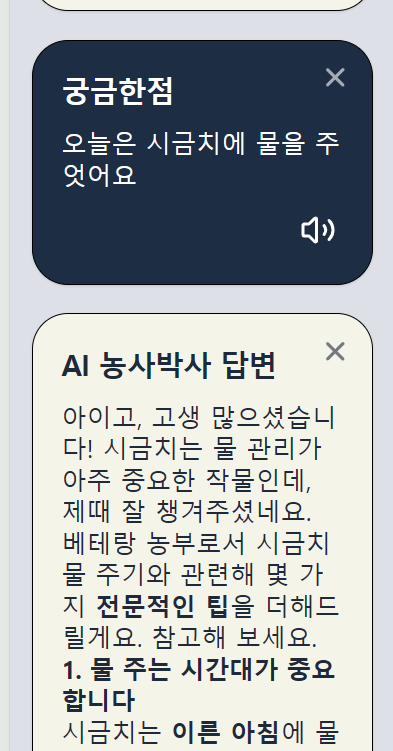
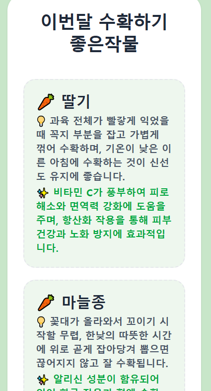
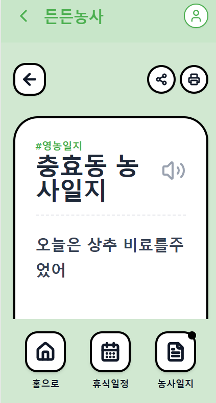

# 🌾 든든농사 (Smart Agri-Tech Platform)
> **"말 한마디로 기록하고 큰 글씨로 관리하는 어르신 맞춤형 스마트 영농 파트너"**

<p align="center">
  
  
  
</p>

---

## 🧑 조진훈 | AI Collaboration Product Manager
> **"AI와 주도적으로 협업하며 사용자의 진짜 문제를 발견하고, 디지털 소외 계층까지 배려하는 따뜻한 서비스를 설계합니다."**

* **Role:** Product Management · UI/UX Design · Front-End Development
* **Tools & Tech:** Gemini, Claude, Google AI Studio, Figma, HTML/CSS/JS

---

## 💡 ABOUT ME : 핵심 역량

### 🛠️ 문제 해결 중심 설계
단순히 화려한 기능을 만드는 것을 넘어 사용자의 진짜 불편함을 발견하고, 디지털 소외 계층까지 배려하는 따뜻한 서비스를 설계합니다.

### 🤖 AI 협업 마스터 (AX Specialist)
Gemini, Claude 등 최신 멀티 AI 엔진을 기획 파트너로 적극 활용하여 비즈니스 가설 검증, 페르소나 설계, 와이어프레임 구조화의 생산성을 극대화합니다.

### 🌱 지속 성장 및 실행력
새로운 기술과 도구를 빠르게 습득하며, AI 시대에 필요한 UI/UX 기획으로 폭발적인 실행 속도를 증명합니다.

---

## 🎯 문제 정의 (Problem Definition)
* **해결할 문제:** 기존 스마트팜 앱의 글씨가 너무 작고 메뉴가 복잡하여 어르신들이 사용하기 어렵고, 매일 써야 하는 영농일지 기록이 육체적으로 번거로움.
* **차별점:** 음성 인식 기반 영농 일지와 **'초간편 모드 UI'**를 통해 스마트폰 조작 부담을 획기적으로 해결.
* **기대 효과:** 어르신들의 디지털 소외 현상 극복, 정확한 데이터 기반의 고품질 작물 생산, 국가 공공 농업 데이터 확보 기여.

---

## 👥 타겟 사용자 & 페르소나 스토리

> **"제가 만나고 싶은 사용자들의 목소리에서 기획을 시작했습니다."**

### 👨‍🌾 송대우 할아버지 (62세) | 전라남도 담양 (과수원 운영)
* **불편함:** 과수원의 고지 작업이 많아 꼼꼼한 관리가 필요한데, 기존 앱들은 글씨가 너무 작고 수치 명칭이 복잡함.
* **원하는 것:** 단순하게 기록하고 읽기 쉬운 관리, 자식들에게 농장 상황을 편리하게 공유하기.
* **한줄 요약:** *"아들과 자부심을 나누고 자식과 소통하고 싶은 스마트 시니어 농부"*

### 👨‍🌾 김정용 할아버지 (71세) | 강원도 태백 고원지대 (배추 농사)
* **불편함:** 고산지대의 변덕스러운 날씨 속에서 배추 방제 및 영농 시기를 예측하기 어려움.
* **원하는 것:** 복잡한 조작 없이 "오늘 내 밭에 꼭 해야 할 핵심 농작업(물주기, 약치기 등)"만 직관적으로 확인하는 것.
* **한줄 요약:** *"복잡한 건 싫고, 오늘 당장 해야 할 일만 콕 집어 알려주길 바라는 베테랑 농부"*

### 👵 강은순 할머니 (81세) | 전라남도 장흥 (시금치·미나리 밭농사)
* **불편함:** 연세로 인해 어떤 씨앗을 심었고 어떤 비료를 언제 주었는지 기억이 자꾸 가물가물함.
* **원하는 것:** 내 소중한 농사 기록이 자동으로 보관되어 나중에 언제든 손쉽게 참고할 수 있는 시스템.
* **한줄 요약:** *"기록은 어렵지만, 내 소중한 평생의 농사 경험을 쉽게 남기고 싶은 할머니"*

---

## ⭐ MVP 핵심 기능 (Key Features)

### 01. 음성 농업 AI 시스템 (Voice to Data)
* 키보드 입력 없이 **"오늘 비료 줬다"**라고 말하면 AI가 시간과 내용을 인지하여 영농일지에 자동 기록합니다.

### 02. 시니어 특화 UI (Age-Friendly UI)
* 모든 버튼과 글씨를 일반 앱 대비 **1.5배 크게 배치**하고, "오늘 날씨 좋음", "물 줄 시간" 등 직관적인 한글 중심의 안내를 제공합니다.

### 03. 지자체 연계 서비스 (G2C Interface)
* 이번 달의 수확 시기를 정확하게 예측하여 지자체(시·구청)에 전송, 농민의 애로사항을 빠르게 행정 개선으로 이어지도록 소통 창구를 마련합니다.

---

## 📱 앱 구동 서비스 (App Prototypes)

| 💬 AI 소통 가이드 | 🌾 AI 추천 작물 안내 | 👨‍👩‍👧‍👦 가족 공유 일지 |
| :---: | :---: | :---: |
|  |  |  |
| 사용자가 농사에 대해 궁금한 점을 AI와 실시간으로 대화하며 해결합니다. | AI가 분석하여 해당 월에 수확하기 가장 좋은 최적의 작물을 추천합니다. | 멀리 있는 가족들과 농장 상황을 실시간 공유하며 협업 농업을 돕습니다. |

---

## 🔮 차세대 확장 기능 (Next-Step Vision)
> **⚠️ 단독 앱 구현이 아닌, 전국 농산물 물류 인프라, PG 결제 대행망 및 지자체 협업이 전제되어야 실현 가능한 비즈니스 확장 스펙입니다.**

### 1. 🚨 SOS 긴급 안전 기능
* 지정된 보호자(가족)에게 긴급 SMS 및 푸시 알림 전송.
* 실시간 GPS 위치 공유를 통한 현장 사고 즉각 감지 및 119/인근 파출소 자동 신고 연동.

### 2. 🌾 든든자랑 & 든든 미식광장 (D2C 유통 다각화 UI/UX)
* **든든자랑 (농업인 전용 홍보·판매 시스템):** 상세페이지 개설의 한계를 극복하기 위해, 밭에서 찍은 작물 사진과 가격만 등록하면 전국 구매자에게 노출되는 심플 직거래 UX.
* **든든 미식광장 (소비자 유도 콘텐츠 UI):**
  * **[상단 네모 UI]:** 지역별 특산물로 바로 연결되는 직관적인 지역 숏컷 탭 배치.
  * **[하단 카드뉴스 UI]:** "7월 제철 작물 스토리텔링" 콘텐츠를 통해 유저의 구매 욕구를 자극하고 [바로 구매하기]로의 높은 전환(Conversion) 유도.

### 3. 🎯 유통마진 혁신을 위한 3대 핵심 솔루션
* **1단계 [산지 직송 D2C 직거래 매칭]:** 복잡한 경매 절차를 생략하고 생산자와 소비자를 1:1 다이렉트 연결하여 농민 마진 20~30% 확보, 소비자 구매가 10~20% 절감.
* **2단계 [초간편 등록 시스템]:** 인스타그램에 사진을 올리듯 `[사진 + 가격 + 한 줄 설명]`만으로 등록이 완료되는 극단적 단순화 설계.
* **3단계 [지자체·우체국 연계 공동 물류망 연동]:** 로컬 농협 집하장 및 우체국 배송 API를 연동하여, 수확 후 집하장 전달 시 배송 및 정산이 원스톱 자동 처리되는 원격 유통 혁신.

---

## 🤖 AI 협업 워크플로우 & 프롬프트 활용

```mermaid
graph TD
    A[Step 1: Gemini] -->|아이디어 가설 검증 & 페르소나 정밀화| B[Step 2: Claude]
    B -->|색상 콘셉트 추출 & Figma 가이드라인| C[Step 3: Google AI Studio]
    C -->|프로토타입 핵심 로직 및 데모 작동성 검증| D[Step 4: Self-Feedback Loop]
    D -->|UT 피드백 기반 지속적인 고도화| A
